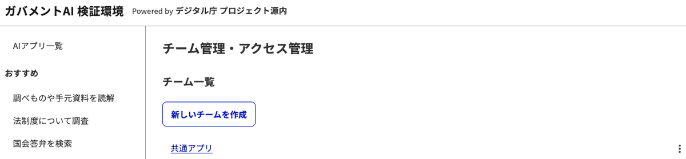
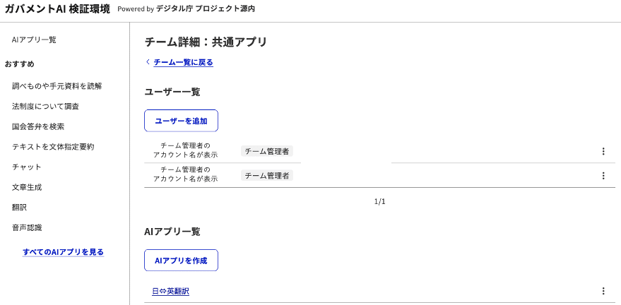
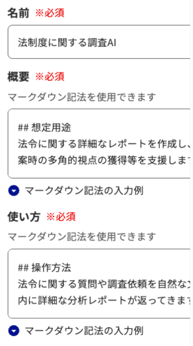
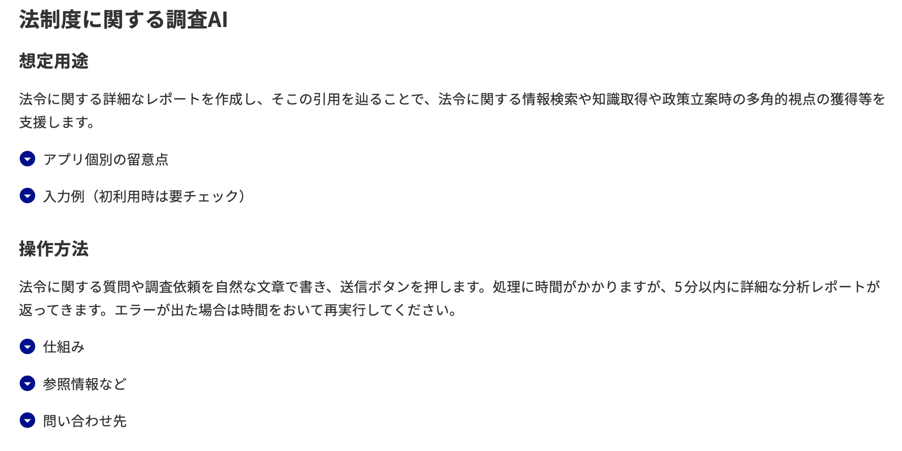
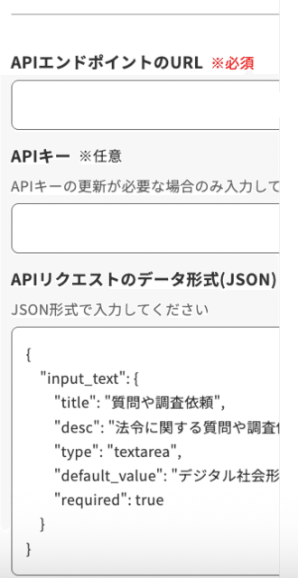
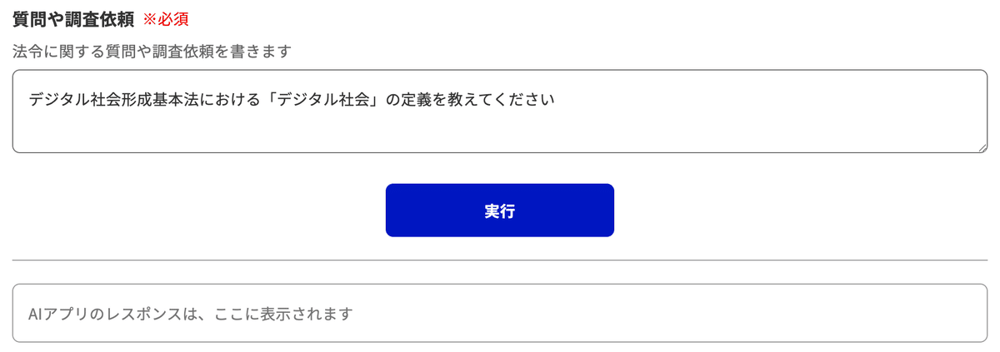
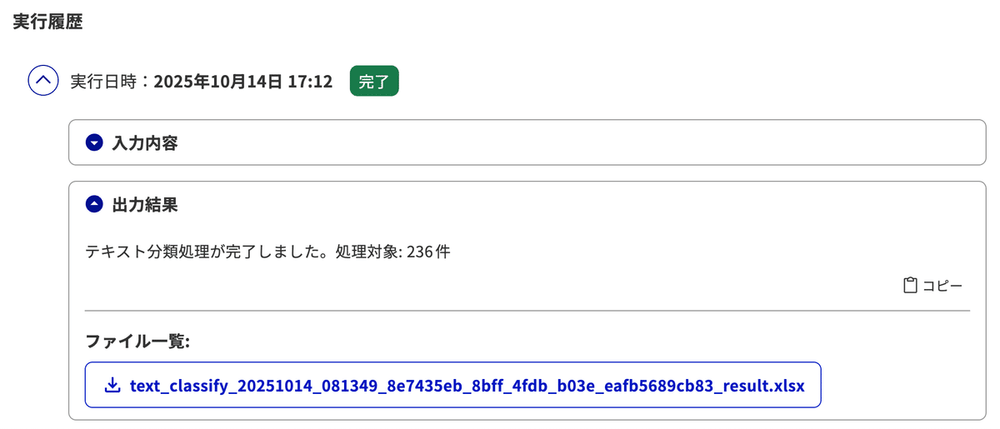

# AI アプリ開発ガイド

行政実務用 AI アプリは、源内 Web 向けに定義された API 仕様に従います。

詳細は [AI アプリ API 仕様](./AIアプリAPI仕様.md) を参照してください。

## 概要

- リクエスト形式: JSON 定義で UI コンポーネント（テキスト、ファイル、セレクトボックス等）を自動生成
- 対応コンポーネント: text, number, textarea, file, select, checkbox, radio, hidden
- 実行方式: 同期実行と非同期実行の両方に対応
- レスポンス形式: テキスト出力（Markdown 対応）およびファイル出力（Base64 エンコード）

詳細なリクエスト/レスポンス形式、サンプルコード、実装例については、上記 API 仕様書を参照してください

## UI スクリーンショット

### チーム管理画面

**図: 源内 Web でのチーム管理画面** (開発中のもの)

### AI アプリ登録画面

**図: 源内 Web における AI アプリ登録画面** (開発中のもの)

### AI アプリ作成画面

**図: 源内 Web での個別の AI アプリを作成（登録）する画面の前半部分** (開発中のもの)

ここで「名前」「概要」「使い方」に記載したテキストは、利用者に表示されます。

**図: 個別の AI アプリの利用者への表示画面（前半）** (開発中のもの)

**図: 源内 Web での個別の AI アプリを作成（登録）する画面の後半部分** (開発中のもの)

API リクエストのデータ形式（JSON）の記述に基づいて、利用者向けの実行画面が自動生成されます。

**図: 個別の AI アプリの利用者への表示画面（後半）** (開発中のもの)

### 非同期実行結果

**図: 非同期実行の出力結果の例** (開発中のもの)
