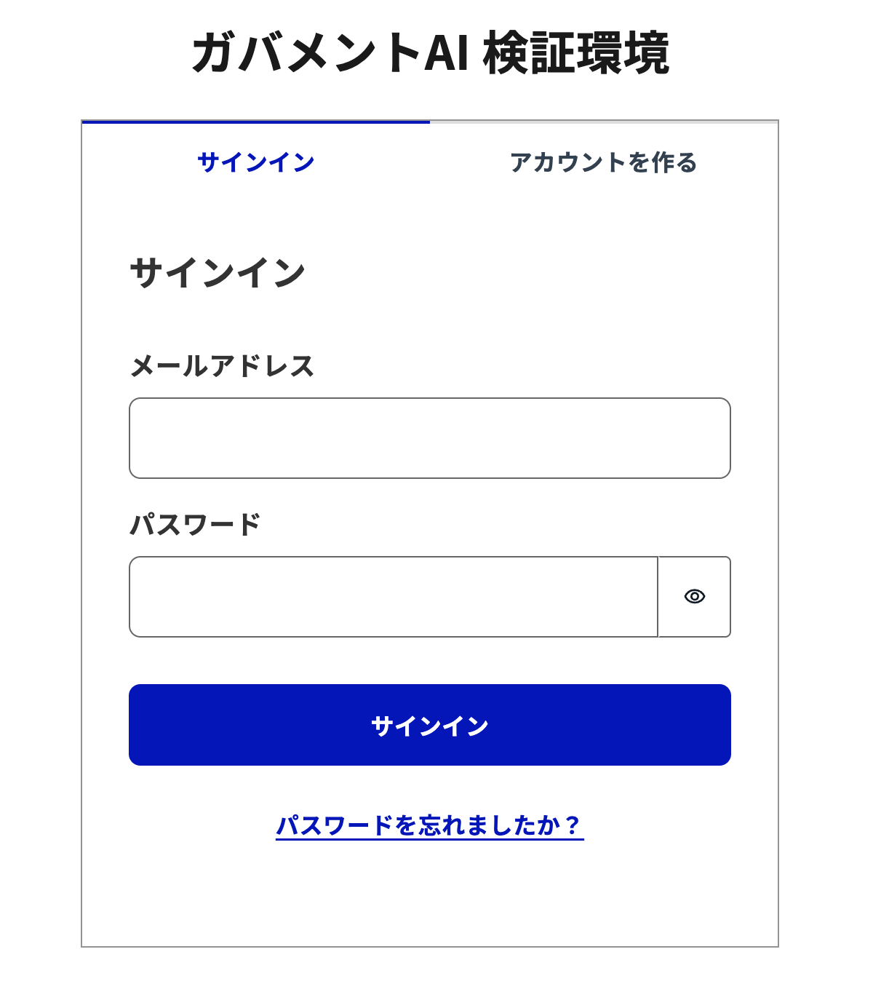
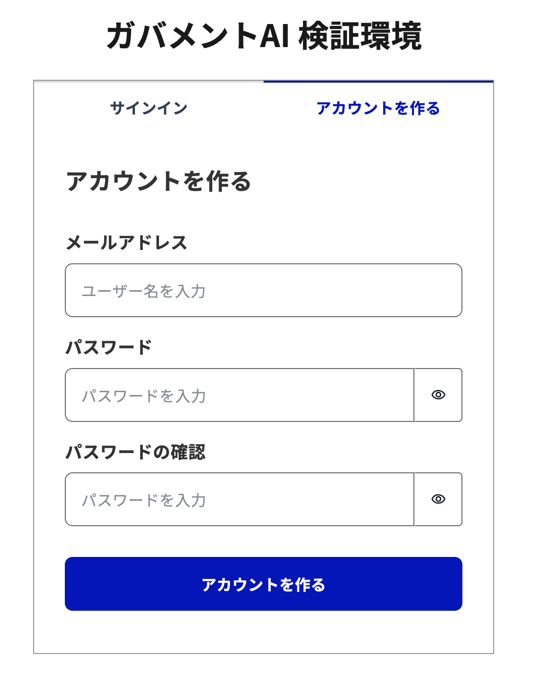

# アカウント登録

## 概要

アカウント登録方法は、[デプロイ手順](./デプロイ手順.md) で `selfSignUpEnabled` を `true` にするか `false` にするかによって異なります。  
これらの違いについて以下に説明します。  

## SelfSignUpが有効な場合

デプロイ完了後、CloudFront の URL またはご自身で設定したドメインにアクセスすると、以下のログイン画面が表示されます。

上部の「アカウントを作る」タブをクリックしてください。以下のアカウント登録画面が表示されます。

必要な情報を入力し、「アカウントを作る」ボタンをクリックしてください。  
次の画面で認証コードを入力すると、アカウント登録が完了し、ログインできるようになります。

## SelfSignUpが無効な場合

1. デプロイ完了後に作成された Cognito User Pool の管理画面にアクセスし、以下の設定でユーザーを手動で登録してください
    - 招待メッセージ: E メールで招待を送信を選択
    - E メールアドレスを検証済みとしてマーク: チェックを入れる
    - 仮パスワード: パスワードの生成を選択
2. ユーザーを登録後、UserGroup グループにユーザーを追加してください
3. 初回ログイン用のパスワードが記載されたメールを確認しパスワードを控えてください
4. CloudFront の URL またはご自身で設定したドメインにアクセスしてください
5. ログイン画面が表示されるので、メールアドレスとパスワードを入力してログインしてください
6. パスワードを再設定してください

## 注意点

`selfSignUpEnabled` を `true` にする場合、`allowedSignUpEmailDomains` に登録を許可するメールドメインを指定することを推奨します。指定しない場合、どのドメインのメールアドレスでも登録できるようになります。
